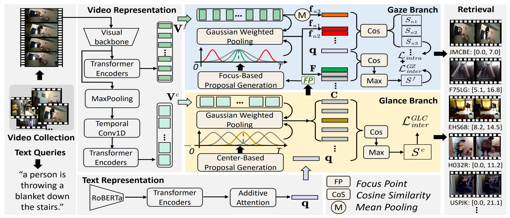

# Introduction
PyTorch implementation for ACM MM2023 paper:

Joint Searching and Grounding: Multi-Granularity Video Content Retrieval


> The codes are modified from [TVR](https://github.com/jayleicn/TVRetrieval) and [MS-SL](https://github.com/HuiGuanLab/ms-sl)


# Environments 
* **python 3.10**
* **pytorch 1.13.1**
* **torchvision 0.14.1**
* **tensorboard 2.10.0**
* **tqdm 4.64.1**
* **easydict 1.10**
* **h5py 3.7.0**
* **cuda 11.7**

# Data Preparation
The data split files, textual RoBERTa features and visual features of Charades-STA dataset can be downloaded from [Baidu Cloud Disk](https://pan.baidu.com/s/1B9fK8fA7Hy_1NTZ2m1DBCg?pwd=e8cy) or [Google Drive](https://drive.google.com/file/d/181wKl3GjgmcULv0ps0XGyMvndJTrIpN1/view?usp=sharing). The directory structure is expected to be the following:
```
data
|-- charades
|   |-- TextData
|   |-- charades_i3d_rgb_lgi.hdf5
```

# Training and Evaluation

## Training
Run the following scripts to train `JSG` on the corresponding dataset.

```
#Add project root to PYTHONPATH (Note that you need to do this each time you start a new session.)
source setup.sh

EXP_ID=train_jsg
GPU_DEVICE_ID=0
ROOTPATH=$HOME/data

./charades.sh $EXP_ID $GPU_DEVICE_ID $ROOTPATH
```

## Evaluation
The model is placed in the directory $ROOTPATH/$DATASET/results/$MODELDIR after training. Run the following script to evaluate it(Suppose the model is trained on Charades-STA):
```
DATASET=charades
EVALID=eval_jsg
ROOTPATH=$HOME/data
MODELDIR=xxx

./test.sh $DATASET $EVALID $ROOTPATH $MODELDIR
```

# Model Performance 

## Video-level retrieval performance

**On Charades-STA**
|             | R@1  | R@5  | R@10 | R@100 | SumR  |
| :---------: | :--: | :--: | :--: | :---: | :---: |
| JSG | 2.4 | 7.7 | 12.8 | 49.8  | 72.7 |


## Event-level retrieval performance

**On Charades-STA**
|             | IoU=0.3, R@10  | IoU=0.3, R@100  | IoU=0.5, R@10  | IoU=0.5, R@100 | IoU=0.7, R@10 | IoU=0.7, R@100 |
| :---------: | :--: | :--: | :--: | :---: | :---: | :---: |
| JSG | 7.23 | 28.71 | 5.67 | 22.50  | 3.28 | 12.34 |
